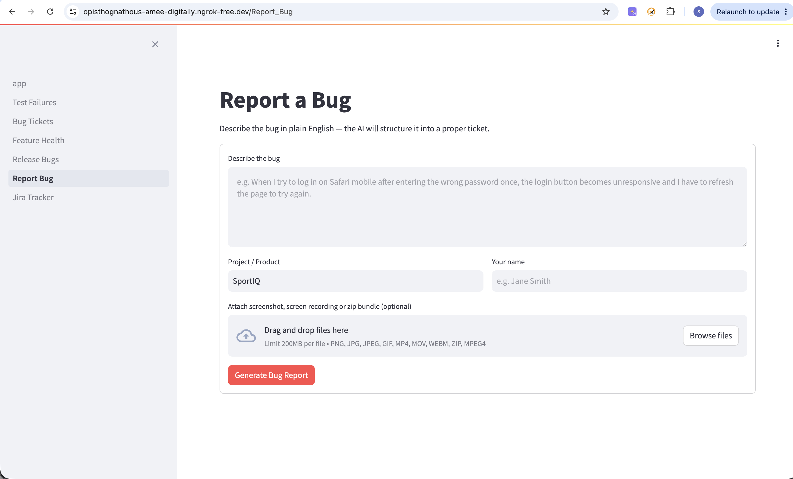
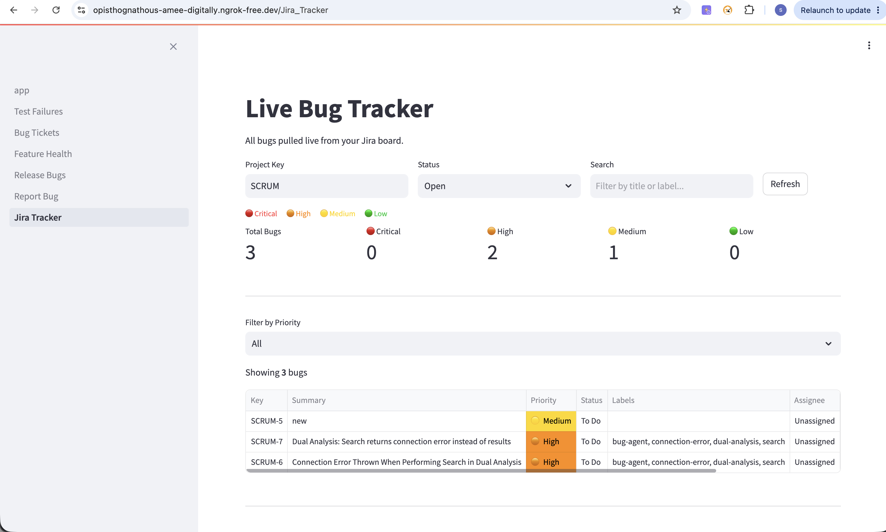

# Bug Tracking Agent

A bug intelligence platform that integrates GitHub Actions, Jira, TestRail, and Claude AI to automate bug detection, analysis, and reporting.

---

## Demo

> **Watch the full workflow:** [demo.mov](docs/demo.mov)
>
> The video walks through: describing a bug in plain English → AI structures it → Playwright verifies it on the live app → pushed to Jira with screenshots attached.

### Screenshots

**Report a Bug — plain English input, AI-structured output**



**Live Jira Bug Tracker — colour-coded by priority, pulled live from Jira**



---

## What It Does

### Automated CI Bug Detection
- Listens to GitHub Actions webhook events
- Downloads JUnit XML test artifacts on failure
- Claude AI analyses failures and generates structured bug reports
- Draft tickets appear in the dashboard for review before pushing to Jira

### Manual Bug Reporting
- Any team member describes a bug in plain English
- Claude AI converts it into a professional, structured Jira ticket
- Attach screenshots, screen recordings, or zip bundles
- **Verify Bug on App** — headless Playwright browser follows the steps on your real app, screenshots every step, and confirms whether the bug is reproducible
- Console errors captured automatically and included in the Jira ticket

### Live Jira Bug Tracker
- Pulls all open bugs live from your Jira board
- Colour-coded by priority (Critical → High → Medium → Low)
- Filter by status, priority, label, or search by title
- Drill into any ticket for full details

### Feature Health Dashboard
- Track which features fail most frequently across CI runs
- Failure rate % per feature area
- Most flaky tests ranked by failure count
- 30-day failure trend charts

### Release Bug Tracking
- Tag bugs in Jira with a version label (e.g. `v1.2.0`)
- Enter that version in the dashboard to instantly see all bugs for that release
- Metrics: total bugs, still open, fixed, % release readiness
- Bugs split into **Still Open** and **Fixed** tabs, colour-coded by priority
- No manual snapshots — Jira labels are the source of truth

---

## Architecture

```
GitHub Actions (CI fails)
        │
        ▼ webhook
FastAPI Webhook Service (port 8000)
        │ validates HMAC-SHA256 signature
        ▼
Redis Queue
        │
        ▼
ARQ Worker
  ├── Downloads JUnit XML from GitHub Artifacts
  ├── Parses test failures
  ├── Updates failure stats
  └── Claude AI analysis → bug draft saved to DB
        │
        ▼
PostgreSQL Database
        │
        ▼
Streamlit Dashboard (port 8501)
  ├── Review & push CI bug drafts to Jira
  ├── Report bugs manually (plain English → AI → Jira)
  ├── Verify bugs with Playwright on real app
  ├── Live Jira bug tracker
  ├── Feature health & failure trends
  └── Release bug tracking by Jira label
```

---

## Tech Stack

| Layer | Technology |
|-------|-----------|
| Backend | Python, FastAPI |
| AI | Claude claude-sonnet-4-6 (Anthropic) |
| Dashboard | Streamlit |
| Database | PostgreSQL |
| Queue | Redis + ARQ |
| Browser Automation | Playwright (Chromium) |
| Deployment | Docker Compose |

---

## Services

| Container | Purpose | Port |
|-----------|---------|------|
| `bta_webhook` | GitHub webhook receiver | 8000 |
| `bta_worker` | ARQ background job worker | — |
| `bta_dashboard` | Streamlit UI | 8501 |
| `bta_postgres` | PostgreSQL database | 5432 |
| `bta_redis` | Redis queue | 6379 |

---

## Setup

### 1. Clone and configure

```bash
git clone <repo>
cd bug-tracking-agent
cp .env.example .env
```

Edit `.env` with your credentials:

```env
# GitHub
GITHUB_TOKEN=github_pat_xxxx         # Personal access token (read: actions, contents)
GITHUB_WEBHOOK_SECRET=your_secret    # Any random string — must match GitHub webhook config
GITHUB_REPO=your-org/your-repo       # Repo where CI runs (owner/repo format)

# Jira
JIRA_BASE_URL=https://your-org.atlassian.net
JIRA_EMAIL=your@email.com
JIRA_API_TOKEN=your_jira_api_token   # id.atlassian.com → Security → API Tokens
JIRA_PROJECT_KEY=SCRUM               # Your Jira project key

# Anthropic
ANTHROPIC_API_KEY=sk-ant-xxxx

# App under test
APP_URL=http://host.docker.internal:3000   # Your app URL for Playwright verification
PROJECT_NAME=YourProjectName
```

### 2. Start everything

```bash
docker-compose up --build -d
```

### 3. Verify it's running

```bash
docker-compose ps
curl http://localhost:8000/health
```

### 4. Open the dashboard

```
http://localhost:8501
```

---

## GitHub Webhook Setup

1. Go to your GitHub repo → **Settings → Webhooks → Add webhook**
2. Set:
   - **Payload URL**: `https://your-domain/webhooks/github`
   - **Content type**: `application/json`
   - **Secret**: value of `GITHUB_WEBHOOK_SECRET` from `.env`
   - **Events**: select **Workflow runs** only
3. Click **Add webhook**

> For local development, expose port 8000 with ngrok:
> ```bash
> ngrok http 8000
> ```

---

## GitHub Token Permissions

Generate at: **GitHub → Settings → Developer Settings → Personal Access Tokens → Fine-grained tokens**

Required permissions:
- `Actions` → Read
- `Contents` → Read
- `Metadata` → Read

---

## Making It Public (Team Access)

```bash
# Dashboard
ngrok http 8501

# Webhook receiver (for GitHub to send events)
ngrok http 8000
```

> Free ngrok allows 1 tunnel at a time. Upgrade to Personal ($10/month) for 2+ tunnels.

---

## Dashboard Pages

| Page | Description |
|------|-------------|
| **Home** | Summary metrics — draft bugs, open bugs, recent failures |
| **Test Failures** | Browse CI test failures, filter by branch or feature |
| **Bug Tickets** | Review AI-drafted CI bugs, push to Jira with full stack traces |
| **Feature Health** | Failure rates per feature, flaky test ranking, 30-day trend |
| **Release Bugs** | Enter a version label to see all Jira bugs for that release — open vs fixed |
| **Report a Bug** | Manual bug reporting — plain English → AI → Jira + file attachments |
| **Jira Tracker** | Live bug tracker pulled from Jira, colour-coded by priority |

---

## Bug Verification (Playwright)

When reporting a bug manually, click **Verify Bug on App** to:

1. Launch headless Chromium inside Docker
2. Navigate to your app (`APP_URL`)
3. Follow AI-generated steps to reproduce
4. Screenshot every step
5. Claude vision analyses each screenshot
6. Returns: confirmed/not confirmed + per-step observations + console errors

All screenshots and console errors are automatically attached to the Jira ticket when pushed.

**Requirements:**
- Your app must be running and accessible at `APP_URL`
- For local apps: use `http://host.docker.internal:<port>`
- For deployed apps: set `APP_URL` to your staging URL

---

## Stopping

```bash
docker-compose down
```

To also remove the database volume:

```bash
docker-compose down -v
```

---

## Environment Variables Reference

| Variable | Required | Description |
|----------|----------|-------------|
| `DATABASE_URL` | Yes | PostgreSQL connection string |
| `REDIS_URL` | Yes | Redis connection string |
| `GITHUB_TOKEN` | Yes | GitHub PAT for downloading artifacts |
| `GITHUB_WEBHOOK_SECRET` | Yes | HMAC secret for webhook validation |
| `GITHUB_REPO` | Yes | `owner/repo` of the repo being tracked |
| `JIRA_BASE_URL` | Yes | `https://your-org.atlassian.net` |
| `JIRA_EMAIL` | Yes | Jira account email |
| `JIRA_API_TOKEN` | Yes | Jira API token |
| `JIRA_PROJECT_KEY` | Yes | Jira project key (e.g. `SCRUM`) |
| `ANTHROPIC_API_KEY` | Yes | Claude API key |
| `APP_URL` | Yes | URL of app under test for Playwright |
| `PROJECT_NAME` | No | Display name shown in dashboard |
| `APP_ENV` | No | `development` or `production` |
| `LOG_LEVEL` | No | `INFO` or `DEBUG` |
